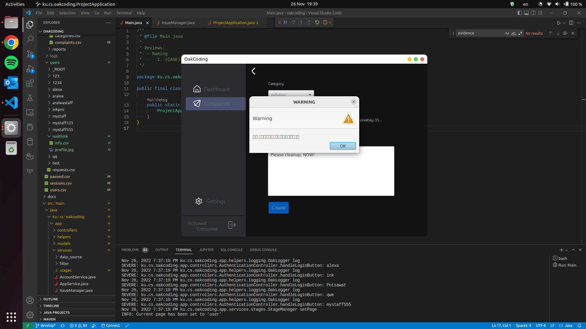
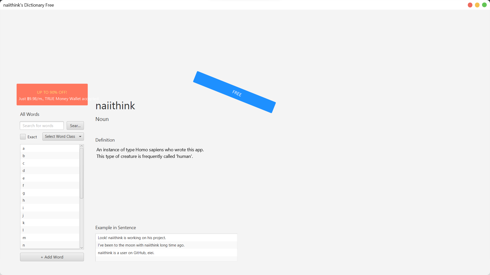

# Stage Manager

> [!NOTE]  
> Contributions are welcomed &#x1F919;

**Stage Manager** is a fully customizable JavaFX window (or Stage) manager
featuring page routing, window customizations such as window title, control buttons, shadow, and corner redius.
It is also capable of managing multiple windows.

I verbatim copied and pasted reuseable code from [naiithink/ku-2022-01418211-dictionary](https://github.com/naiithink/ku-2022-01418211-dictionary/tree/ef2e49d5a407066a56f3f8ded528e95a2544576b/src/main/java/com/github/naiithink/app/services)
and [naiithink/ku-2022-01418211-oakcoding](https://github.com/naiithink/ku-2022-01418211-oakcoding/tree/48857f5ec330535ee64dc618695e4f3d8ce9278f/src/main/java/ku/cs/oakcoding/app/services/stages).
Both projects were developed in 2022.

I am looking forward to standardizing this source code into a Java package of modules for imports.

My approach to modularize the source back in the day it was actively developed
can be seen at [naiithink/ku-2022-01418211-oakcoding](https://github.com/naiithink/ku-2022-01418211-oakcoding/tree/48857f5ec330535ee64dc618695e4f3d8ce9278f/src/main/java/ku/cs/oakcoding/app/services/stages).
But unfortunately, I have not been available for futher development because of classes.

## Examples

Ubuntu Desktop  

Rounded corners, custom top grabbing area,
and the control buttons are arranged yellow, green, and red!

---

Windows

Custom top grabbing area and control buttons are arranged red, yellow, and green!

---

**Stage Manager** also, of course, supports macOS!
